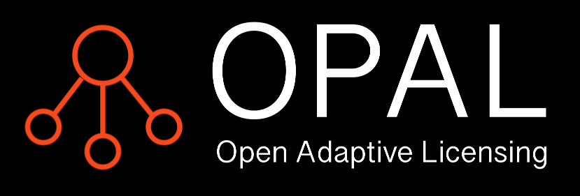
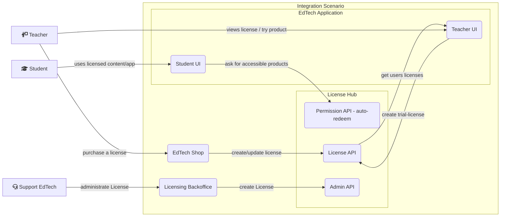
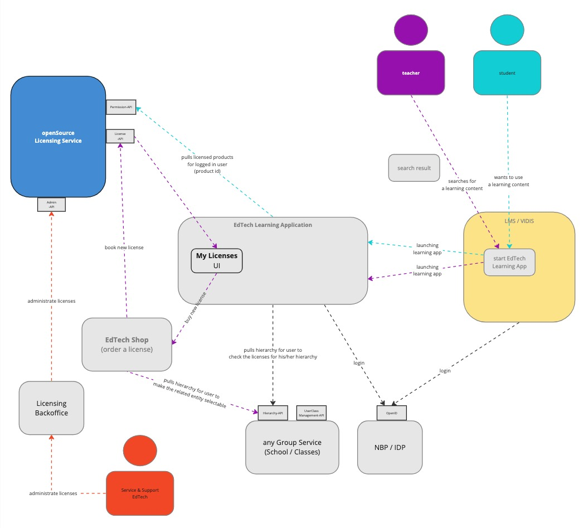

<!-- PROJECT SHIELDS -->
<a name="readme-top"></a>
<!--
*** I'm using markdown "reference style" links for readability.
*** Reference links are enclosed in brackets [ ] instead of parentheses ( ).
*** See the bottom of this document for the declaration of the reference variables
*** for contributors-url, forks-url, etc. This is an optional, concise syntax you may use.
*** https://www.markdownguide.org/basic-syntax/#reference-style-links

*** the shields at the beginning are only working if the Repo is released in public

[![Contributors][contributors-shield]][contributors-url]
-->

 [![Forks][forks-shield]][forks-url]
[![Stargazers][stars-shield]][stars-url]
[![Issues][issues-shield]][issues-url]
[![MIT License][license-shield]][license-url]
[![LinkedIn][linkedin-shield]][linkedin-url]
 

    <div>
        
    </div>


### Open
OPAL is committed to being an open solution, embracing transparency, collaboration and fostering a community where developers and organizations can work together to improve and customize the licensing service to meet their unique needs.

### Adaptive
OPAL is adaptive to serve different license models of digital products as well as to different hierarchies within your customer landscape.

### Licensing
At its core, OPAL is a comprehensive licensing service designed to simplify and manage the licensing of digital products.

<div align="right">
 </div>

# Description


<!--  -->

## Why

EdTechs build Products to change the way we learn. We learned that it's quite a bit of an effort to work on the administrational features to get your learning application into usage. One of the topics is, how to license your product in the differnet organizational structures. That's why we worked on a solution which works in differrent IDP environments. 

## What

Our Licensing Service is able to provide *product* permissions for *various connected IDPs* based on an external *hierarchy* with an *autoredeeming* process to use the license. 

We build a licensing service which combines the need of licensing on different levels (Enities) within a hierarchy and a seat baes licensing. So users which are member of an entity owning a license can automatically use the product.

<!-- Licensing Glossary -->
<details>
  <summary>Licensing Glossary</summary>
  <ol>
    <li>User
      <ul>
        <li>An authenticated user of your application.</li>
      </ul>
    </li>
    <li>Product
      <ul>
        <li>A product is an application or content.</li>
      </ul>
    </li>
    <li>Hierarchy
      <ul>
        <li>Is an organizational structure on each entity within this structure a license could be linked.</li>
      </ul>
    </li>
    <li>Membership
      <ul>
        <li>A User is member of different entities.</li>
      </ul>
    </li>
    <li>Entity
      <ul>
        <li>A Knot within a Hierarchy like a school, grade or class.</li>
      </ul>
    </li>
    <li>Permission
      <ul>
        <li>A User gets permission to a product if he/she is member of an entity within a hierarchy which ownes a valid license.</li>
      </ul>
    </li>
    <li>IDP
      <ul>
        <li>Identity Provider</li>
      </ul>
    </li>

  </ol>
</details>

## For whom

* You want to license (educational) products (Content or App)?
* Your customers / users are part of a hierarchy structure in which they want to buy licenses?
* You are facing multible IDPs in your different customer environments?
* You want to have a seat based licensing in place?

<p align="right">(<a href="#readme-top">back to top</a>)</p>

# Table of Contents

<a href="#installation">Installation</a><br>
<a href="#usage">Usage</a><br>
<a href="#documentation">Documentation</a><br>
<a href="#license">License</a><br>

<p align="right">(<a href="#readme-top">back to top</a>)</p>

# Installation

## K8S
Best practice is to run the application in a local k8s cluster. Please see <a href="k8s/README.md">k8s/README.md</a>:
### Initialization
```bash
make k8s_install
make k8s_synth
make init
```
#### Starting
```bash
make start
```

## Manually
Alternatively you can start the application "by hand"
Create a 'dotenv' file:
Create a file named '.env' in the root folder of the app and provide your database paramaters and credentials like so:

```
DB_USER=<<your 'postgres' user name (root user of the RDBMS)>>
DB_PASSWORD=<<your 'postgres' users (root user of the RDBMS) password>>
DB_HOST="localhost"
DB_PORT="5432"
DB_NAME=<<the name of the 'license-manager' database you will create in the following step (licm)>>
```
Before you can start the application, you have to install a database. Please create a database manually
on your local postgreSQL database using the SQL query

```sql
CREATE DATABASE licm;
```

## Run uvicorn
You can start the application using the following commands:
```sh
cd <licensing>
export PYTHONPATH=$PWD/src
uvicorn services.licensing.main:app --reload --workers 1 --host 0.0.0.0 --port 8000
```

You can now use the API:

(If you run the app by not using Docker)
* API docs: http://localhost:8000/docs
* license API: http://localhost:8000/licenses

<p align="right">(<a href="#readme-top">back to top</a>)</p>

# Testing
Many of our pytest tests require a running Postgres database.
You can use the existing docker-compose definition to start a test database.
```bash
docker compose up test-postgres
```
This will start a postgres on port 5431 containing the `test_licensing` db.
Before starting `pytest` you will need to set following environment variables:
```bash
DB_HOST=localhost
DB_PORT=5431
DB_USER=postgres
DB_PASSWORD=postgres
SEGMENT=loc00
```

Do we need a comment on migration? GWE
# Migrations with 'alembic'

* generate new migrations:
    ```sh
    alembic revision --autogenerate -m "<some meaningful title>"
    ```

* apply the migrations:
    ```sh
    alembic upgrade head
    ```

## Events
Eventcreation is prepared but could be addapted to special needs.

<p align="right">(<a href="#readme-top">back to top</a>)</p>


# Example installation steps
$ git clone [repository-url]
$ cd [project-directory]
$ npm install


# Usage

[Explain how to use the software. Include examples, code snippets, and any relevant information that users need to get started.]

<p align="right">(<a href="#readme-top">back to top</a>)</p>

# Example usage

$ command-to-run-software [options]

<p align="right">(<a href="#readme-top">back to top</a>)</p>

# Service Documentation

## Used Technologies

* [![Python][Python]][Python-url]
* [![FastAPI][FastAPI]][FastAPI-url]
* [![PostgreSQL][PostgreSQL]][PostgreSQL-url]

## Hierarchy Concept

## License Concept

The concept for implementing such a License Manager can be found here:
[License Manager concept](./docs/concept.md)

## Token Concept

## Data Model

<p align="right">(<a href="#readme-top">back to top</a>)</p>

# License

This project is licensed under the MIT License - see [LICENSE](LICENSE) for details.

<p align="right">(<a href="#readme-top">back to top</a>)</p>

<!-- ROADMAP -->
# Roadmap

- [x] OPAL first public release Open Source Release
- [ ] Add LicenseConnect Interface <a href="https://licenceconnect.schule/">LicenseConnect Project (german)</a>

See the [open issues](https://github.com/bettermarks/opal/issues) for a full list of proposed features (and known issues).

<p align="right">(<a href="#readme-top">back to top</a>)</p>

<!-- CONTACT -->
# Contact

Bettermarks GmbH, Berlin - kontakt@bettermarks.com

Project Link: [https://github.com/bettermarks/opal/](https://github.com/bettermarks/opal/)

<p align="right">(<a href="#readme-top">back to top</a>)</p>


<!-- ACKNOWLEDGMENTS -->
# Acknowledgments

Here are some resources we find helpful and would like to give credit to.

* [Choose an Open Source License](https://choosealicense.com)
* [Img Shields](https://shields.io)

<p align="right">(<a href="#readme-top">back to top</a>)</p>

<!-- MARKDOWN LINKS & IMAGES -->
<!-- https://www.markdownguide.org/basic-syntax/#reference-style-links -->
<!-- 
[contributors-shield]: https://img.shields.io/github/contributors/bettermarks/opal.svg?style=for-the-badge
[contributors-url]: https://github.com/bettermarks/opal/graphs/contributors
-->
[forks-shield]: https://img.shields.io/github/forks/bettermarks/opal.svg?style=for-the-badge
[forks-url]: https://github.com/bettermarks/opal/network/members
[stars-shield]: https://img.shields.io/github/stars/bettermarks/opal.svg?style=for-the-badge
[stars-url]: https://github.com/bettermarks/opal/stargazers
[issues-shield]: https://img.shields.io/github/issues/bettermarks/opal.svg?style=for-the-badge
[issues-url]: https://github.com/bettermarks/opal/issues
[license-shield]: https://img.shields.io/github/license/bettermarks/opal.svg?style=for-the-badge
[license-url]: https://github.com/bettermarks/opal/blob/master/LICENSE
[linkedin-shield]: https://img.shields.io/badge/-LinkedIn-black.svg?style=for-the-badge&logo=linkedin&colorB=555
[linkedin-url]: https://www.linkedin.com/company/bettermarks-gmbh
[Python]: https://img.shields.io/badge/Python-FFD43B?style=for-the-badge&logo=Python&logoColor=4B8BBE
[Python-url]: https://www.python.org/
[FastAPI]: https://img.shields.io/badge/FastAPI-009688?style=for-the-badge&logo=FastAPI&logoColor=FFFFFF
[FastAPI-url]: https://fastapi.tiangolo.com/
[PostgreSQL]: https://img.shields.io/badge/PostgreSQL-008bb9?style=for-the-badge&logo=postgresql&logoColor=FFFFFF
[PostgreSQL-url]: https://www.postgresql.org/
