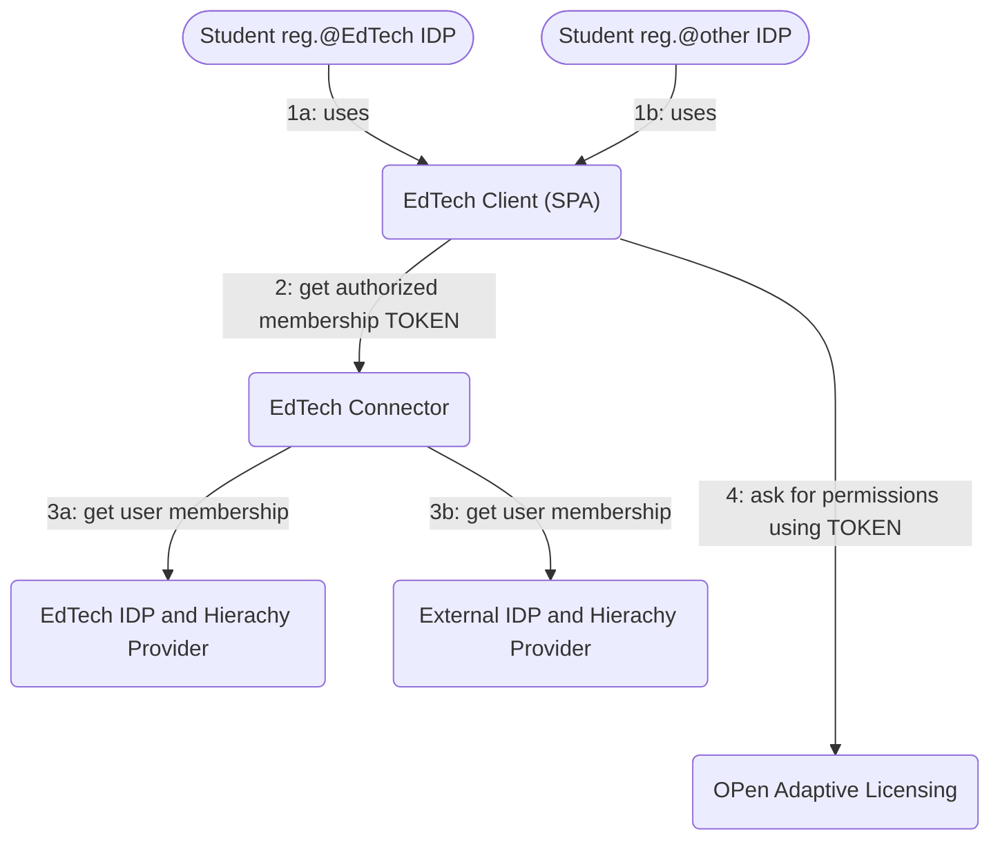

# Authorization Concept for OPAL based on Tokens

The OPen Adaptive Licensing (OPAL) can later be used (as a service) by providers of learning 
application (or content providers) to provide licenses for their content or (using their app) to end users - 
or groups of end users.

In a first step, OPAL should be integrated in a simple way in the "EdTech application". 
In this first step, we are not talking about fine grained permissions to be allowed to use specific parts of 
an application or specific content, we just give an 'allow all' or 'do not allow anything'.

The OPAL concept is based on the following assumptions:

- A user with an account at an IDP (referred to as the ‘hierarchy provider’) and membership in hierarchical structures (such as ‘classes’, ‘schools’, or similar entities) can purchase a license for an entity in that hierarchy they belong to.”
- Another member of a 'licensed' group or school or any other structure in the hierarchy can use that license.

## Authorizing the "Classic Way"

Main drawback: As we have to do a call from OPAL to the hierarchy provider again:
OPAL and each hierarchy provider attached have to 'trust' each other.

## Authorization using Signed Tokens

<!--  -->

The drawback no longer exists: 'valid' hierarchy providers have just to be whitelisted in OPAL 
and OPAL (or even an external trusted key server) holds the public keys of each hierarchy provider.

We have found a way, how hierarchy information for a user can provided in a secure and not 'tamperable' way to OPAL.

