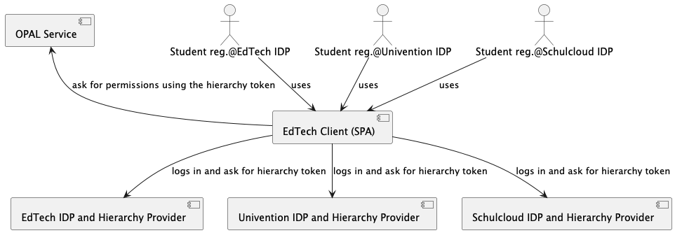
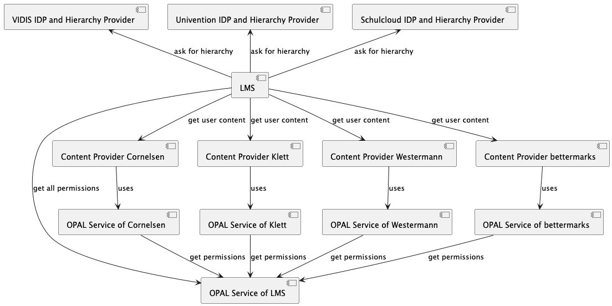

# About integration of OPAL

A specific licensing service will live in a world of multiple applications (or contents) 
for which you can purchase a license, multiple other licensing services hosted by multiple providers, 
multiple product-, ordering-, permissions- and 
other services and, of course, multiple hierarchy provider services (maybe attached to IDP service).

However, a client (usually a SPA or some micro frontend application) will 'use' (communicate with) some set of 
such services to purchase licenses / redeem and use licenses for a specific application (or contents) 
(like specific educational books).

We will assume, that 'a service' is available via a specific URI (we assume, that client side or server 
side service discovery including load balancing is already solved), and each service accepts requests from
a client with authentication or without, in every case some authorization mechanism is used. 

We try to solve the 'integration task', how all the mentioned services can
- communicate with each other (or via the client) in a secure way
- not be misused by using tampered payloads

## Scenarios

### EdTech Client with multible IDPs

Potentially possible not implemented yet:
### LMS with multiple IDP and multiple Content Providers

