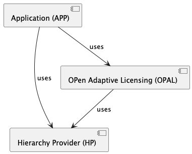

# OPAL Concept

The OPen Adaptive Licensing (OPAL) is basically some Rest API. The OPAL API accepts and handles

* requests from authenticated users to buy (get) licenses
* requests from authenticated users to (implicitly) redeem a
  license seat within a license and get permissions to access some (connected) application or get access to some content

## Components

The OPAL works in some 'integrated' environment, which is made of

* an Application (APP) (in our case an EdTech App), where users can do something
* a [Hierarchy Provider (HP)](hierarchy_provider_concept.md), which holds entity hierarchies.
  HP is usually bundled with an Identity Provider (IDP)
* a Product Serivce (PS), which holds products which can be licensed
* the OPen Adaptive Licensing (OPAL) itself.



## Hierarchy Provider

[Concept of the Hierarchy Provider (HP)](hierarchy_provider_concept.md)

## Product Service

A Service to store the variety of products, the EdTech Application is providing to their customers, no matter what a product is. Product can be:

- an application access
- a content
- a feature

### Getting Products
This route returns all 'available products'. To keep it simple, we have just one product, that is associated with
'full access'. 

```
GET /products
```
would return something like
```json
[
 {"eid": "et_full_access", "name": "EdTech Product Name"} 
]
```

## OPen Adaptive Licensing (OPAL)

The OPAL is a web service, that implements a couple of routes
that can be used by the users of the application. The 'links' representing
the web service calls are provided to the users by the application.

The following routes:

### Booking a trial license

Booking a trial license for a product is a possibility to start a given trial phase. If this is offered by the EdTech 
App is a question of integrating this route into the product or not.

```
POST /member/licenses/trial/
```
with a request body like:
```json
{
  "extra_seats": 0,
  "nof_seats": 50,
  "owner_eid": "34535356324",
  "owner_level": 1,
  "owner_type": "class",
  "product_eid": "full_access"
}
```
This trial license is acting right now like a normal license with the same result in "permissions" as a purchased license.

### Purchasing a License

The process of purchasing a license will be a multistep process (getting pricing information, add a license product
with number of seats and duration to a 'shopping cart', purchase ...). We will not implement such a multistep process
in the POC, we will just add one route as follows:
```
POST /order/licenses
```
with some request body like
```json
{
  "product_eid": "full_access",
  "owner_level": "class",
  "owner_eids": ["34535356324", "2346445645646"],
  "nof_seats": 50,
  "extra_seats": 0,
  "is_trial": false,
  "valid_from": "2024-01-01",
  "valid_to": "2024-12-31",
  "hierarchy_provider_uri": "http://0.0.0.0:5001/hierarchy"
}
```
The request body will be interpreted like so: The requesting service wants to add (purchase) a
license for a product with EID='full_access' and an 'entity level' 'class'. He wants to
book the license to be valid from first of January 2024 to the last of December 2024. The
license should be valid for 50 'seats', that means, that 50 students can use the license at the same time. 
The license should be valid for the students, that are members of classes with EID='34535356324' resp.
EID='2346445645646". Extra Seats is an overbooking feature of OPAL, if the EdTech needs that. Is Trial is for booking trial license for a product.

The Hierarchy Provider is the aspect that OPAL is multi IDP ready. You can have in one instance licenses refering to several IDPs.

### Getting Permissions
(and Implicit Redeeming a License)

In the APP:
After using the "product", some call to the OPAL. Should check the permissions...
```
POST /member/permissions
```
without any parameters would check for the permissions of the given user
and implicitly redeem, if NO redeemed license seat can be found for this user. 

We are facing 4 different use cases here:

1. The case 'user does not have a seat yet, but can "occupy one" (has been described above)
   1. if there is only 1 license "occupy one seat"
   2. if the licenses have different owner levels, take the license with the lowest owner level (class before school) and "occupy one"
   3. else "occupy one" randomly
2. The case 'user has already occupied a seat and the license AND the hierarchy structure for the user is still valid'
3. The case 'user has a seat', but the license has expired.
4. The case 'user has a seat, but no longer fulfills the hierarchy criteria'

Case 1 will be described below, cases 2, 3, and 4 can be implemented in a similar way and will not be 
described explicitly here.

#### Licensing Logic:
1. get all seats the user has already occupied 
2. list name: occupied licenses 
   1. check the seats 
   2. if the license expired 
      1. set the seat to EXPIRED 
   3. f the user has disjoined the license owner (class, school)
      1. set the seat to NOT-A-MEMBER 
3. seats matching these criterias are removed from the ‘occupied licenses’ list 
4. extract products from 'occupied licenses'
5. list name: occupied products
6. get all valid licenses for this user per today 
   1. filter out - full used licenses (no free seats)
   2. filter out - licenses with occupied products 
7. list name: unoccupied products 
   1. sort the list of licenses of unoccupied products by 
      1. product 
      2. owner_level (class before school)
      3. free seats 
   2. a seat will be occupied for the FIRST license for EACH product in this sorted list 
8. return the merged list of occupied and unoccupied products

OPEN: 
### Open Questions / Unsolved Issues:
- make it configurable if disjoining an entity leads to a reusable seat or not 
- how we should handle the case of different products with different permissions which are overlapping

